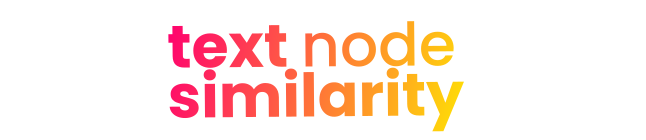

# text-similarity-node

<div style="text-align: center;">
  
</div>


[](https://github.com/piotrmaciejbednarski/text-similarity-node/actions/workflows/test.yml)
[](https://github.com/piotrmaciejbednarski/text-similarity-node/blob/main/LICENSE)

High-performance and memory efficient native C++ text similarity algorithms for Node.js with full Unicode support. text-similarity-node provides a suite of production-ready algorithms that demonstrably outperform pure JavaScript alternatives, especially in memory usage and specific use cases. This library is the best choice for comparing large documents where other JavaScript libraries slow down.

## Key Features

- **High Performance**: Native C++ implementation which is fast and efficient compared to pure JavaScript libraries
- **Memory Efficient**: Optimized for low memory usage and high throughput
- **Asynchronous API**: Non-blocking operations using worker threads
- **Unicode Support**: Full UTF-8 support including emoji and international characters
- **Multiple Algorithms**: 7+ algorithms for different similarity needs
- **Production Ready**: Memory safety, comprehensive testing, and error handling
- **Easy Integration**: Simple API compatible with existing workflows

## Installation

```bash
npm install text-similarity-node
```

## Quick Start

```javascript
const textSimilarity = require('text-similarity-node');

// Levenshtein Similarity (edit distance)
textSimilarity.similarity.levenshtein('hello', 'hallo'); // 0.8

// Jaccard Similarity (set intersection)
textSimilarity.similarity.jaccard('hello world', 'hello universe', true); // 0.33

// Cosine Similarity with different options
textSimilarity.similarity.cosine('hello', 'hallo'); // 0.5 (character n-grams)
textSimilarity.similarity.cosine('hello world', 'hello universe', true); // 0.49 (word-based)

// Additional algorithms
textSimilarity.similarity.jaro('hello', 'hallo'); // 0.86
textSimilarity.similarity.jaroWinkler('hello', 'hallo'); // 0.88
textSimilarity.similarity.dice('hello', 'hallo'); // 0.5

// Distance measurements
textSimilarity.distance.levenshtein('hello', 'hallo'); // 1
textSimilarity.distance.hamming('hello', 'hallo'); // 1

// Unicode Support
textSimilarity.similarity.levenshtein('café', 'cafe'); // 0.75
textSimilarity.similarity.jaccard('Hello 👋 World 🌍', 'Hello 👋 World 🌎'); // 0.86 (different globe emoji)

// Case-insensitive comparison
textSimilarity.similarity.levenshtein('Hello', 'hello', false); // 1.0
```

## Algorithm Overview

The text-similarity-node library was created based on algorithm implementations from the [TextDistance](https://github.com/life4/textdistance) Python library, achieving a 95% success rate for result compatibility between this library and the reference Python version. The 95% compatibility rate is due to different tokenization methods implemented for cosine similarity calculations.

### Edit-Based Algorithms

- **Levenshtein Distance**: Classic edit distance for spell checking and typo detection
- **Hamming Distance**: Fixed-length string comparison for error detection
- **Jaro Similarity**: Optimized for short strings and proper names
- **Jaro-Winkler**: Enhanced Jaro with prefix matching bonus

### Token-Based Algorithms  

- **Jaccard Similarity**: Set intersection for document similarity
- **Sorensen-Dice**: Harmonic mean of precision and recall
- **Overlap Coefficient**: Measures subset relationships

### Vector-Based Algorithms

- **Cosine Similarity**: Angular distance in vector space
- **Character Vectorization**: Optimized frequency-based comparison

## API Reference

### Modern API

The Modern API provides comprehensive configuration options and consistent return formats:

```javascript
const textSimilarity = require('text-similarity-node');

// Basic similarity calculation
const result = textSimilarity.calculateSimilarity('hello', 'hallo');
console.log(result); // { success: true, value: 0.8 }

// Specify algorithm type
const result2 = textSimilarity.calculateSimilarity(
  'hello world', 
  'hello universe', 
  textSimilarity.AlgorithmType.JACCARD
);
console.log(result2); // { success: true, value: 0.39 }

// Full configuration example
const result3 = textSimilarity.calculateSimilarity(
  'hello world',
  'world hello',
  textSimilarity.AlgorithmType.COSINE,
  {
    preprocessing: textSimilarity.PreprocessingMode.WORD,
    caseSensitivity: textSimilarity.CaseSensitivity.INSENSITIVE,
    ngramSize: 2
  }
);
console.log(result3); // { success: true, value: 1.0 }

// Advanced algorithm-specific configuration
const jaroWinklerResult = textSimilarity.calculateSimilarity(
  'martha',
  'marhta',
  textSimilarity.AlgorithmType.JARO_WINKLER,
  {
    prefixWeight: 0.1,
    prefixLength: 4,
    caseSensitivity: textSimilarity.CaseSensitivity.INSENSITIVE
  }
);

// Tversky similarity with custom weights
const tverskyResult = textSimilarity.calculateSimilarity(
  'information retrieval',
  'information extraction',
  textSimilarity.AlgorithmType.TVERSKY,
  {
    preprocessing: textSimilarity.PreprocessingMode.WORD,
    alpha: 0.8,  // Weight for first string
    beta: 0.2,   // Weight for second string
    caseSensitivity: textSimilarity.CaseSensitivity.INSENSITIVE
  }
);

// Distance calculations
const distance = textSimilarity.calculateDistance(
  'kitten',
  'sitting',
  textSimilarity.AlgorithmType.LEVENSHTEIN
);
console.log(distance); // { success: true, value: 3 }

// Batch processing
const pairs = [
  ['hello', 'hallo'],
  ['world', 'word'],
  ['test', 'best']
];
const batchResults = textSimilarity.calculateSimilarityBatch(
  pairs,
  textSimilarity.AlgorithmType.LEVENSHTEIN,
  { caseSensitivity: textSimilarity.CaseSensitivity.INSENSITIVE }
);
console.log(batchResults);
// [{ success: true, value: 0.8 }, { success: true, value: 0.8 }, { success: true, value: 0.75 }]

// Asynchronous API
async function example() {
  const similarity = await textSimilarity.calculateSimilarityAsync(
    'hello world',
    'hello universe',
    textSimilarity.AlgorithmType.COSINE,
    {
      preprocessing: textSimilarity.PreprocessingMode.WORD,
      caseSensitivity: textSimilarity.CaseSensitivity.INSENSITIVE
    }
  );
  console.log(similarity); // 0.5
  
  const batchAsync = await textSimilarity.calculateSimilarityBatchAsync(
    pairs,
    textSimilarity.AlgorithmType.JACCARD
  );
  console.log(batchAsync); // [0.67, 0.8, 0.6]
}

// Global configuration
textSimilarity.setGlobalConfiguration({
  preprocessing: textSimilarity.PreprocessingMode.WORD,
  caseSensitivity: textSimilarity.CaseSensitivity.INSENSITIVE,
  ngramSize: 3
});

// All subsequent calls will use global config unless overridden
const withGlobalConfig = textSimilarity.calculateSimilarity('Hello World', 'hello world');
console.log(withGlobalConfig); // { success: true, value: 1.0 }

// Override global config for specific call
const overrideGlobal = textSimilarity.calculateSimilarity(
  'Hello World',
  'hello world',
  textSimilarity.AlgorithmType.LEVENSHTEIN,
  { caseSensitivity: textSimilarity.CaseSensitivity.SENSITIVE }
);
console.log(overrideGlobal); // { success: true, value: 0.82 }
```

#### Configuration Options

```javascript
// Available algorithm types
textSimilarity.AlgorithmType = {
  LEVENSHTEIN: 0,           // Edit distance
  DAMERAU_LEVENSHTEIN: 1,   // Edit distance with transpositions
  HAMMING: 2,               // Equal-length string distance
  JARO: 3,                  // Fuzzy string matching
  JARO_WINKLER: 4,          // Jaro with prefix weighting
  JACCARD: 5,               // Set similarity coefficient
  SORENSEN_DICE: 6,         // Dice coefficient
  OVERLAP: 7,               // Overlap coefficient  
  TVERSKY: 8,               // Asymmetric similarity with weights
  COSINE: 9,                // Vector space cosine similarity
  EUCLIDEAN: 10,            // Euclidean distance
  MANHATTAN: 11,            // Manhattan distance
  CHEBYSHEV: 12             // Chebyshev distance
};

// Preprocessing modes
textSimilarity.PreprocessingMode = {
  NONE: 0,        // No preprocessing
  CHARACTER: 1,   // Character-level comparison
  WORD: 2,        // Word-level tokenization
  NGRAM: 3        // N-gram based tokenization
};

// Case sensitivity options
textSimilarity.CaseSensitivity = {
  SENSITIVE: 0,   // Case-sensitive comparison
  INSENSITIVE: 1  // Case-insensitive with Unicode support
};

// Full configuration object structure
const fullConfig = {
  algorithm: textSimilarity.AlgorithmType.COSINE,          // Algorithm to use
  preprocessing: textSimilarity.PreprocessingMode.WORD,    // Text processing mode
  caseSensitivity: textSimilarity.CaseSensitivity.INSENSITIVE, // Case handling
  ngramSize: 2,                    // N-gram size (default: 2)
  threshold: 0.5,                  // Early termination threshold
  alpha: 0.5,                      // Tversky alpha parameter
  beta: 0.5,                       // Tversky beta parameter
  prefixWeight: 0.1,               // Jaro-Winkler prefix weight (0.0-0.25)
  prefixLength: 4                  // Jaro-Winkler max prefix length
};
```

#### Utility Functions

```javascript
// Get supported algorithms
const algorithms = textSimilarity.getSupportedAlgorithms();
console.log(algorithms);
// [{ type: 0, name: 'LEVENSHTEIN' }, { type: 5, name: 'JACCARD' }, ...]

// Memory management
const memoryUsage = textSimilarity.getMemoryUsage();
console.log(`Memory usage: ${memoryUsage} bytes`);

textSimilarity.clearCaches(); // Clear internal caches

// Get current global configuration
const currentConfig = textSimilarity.getGlobalConfiguration();
console.log(currentConfig);
```

### Convenience API

#### Similarity Functions

```javascript
// Edit-based algorithms
textSimilarity.similarity.levenshtein(s1, s2, caseSensitive = true)
textSimilarity.similarity.damerauLevenshtein(s1, s2, caseSensitive = true)
textSimilarity.similarity.hamming(s1, s2, caseSensitive = true)

// Phonetic algorithms
textSimilarity.similarity.jaro(s1, s2, caseSensitive = true)
textSimilarity.similarity.jaroWinkler(s1, s2, caseSensitive = true, prefixWeight = 0.1)

// Token-based algorithms
textSimilarity.similarity.jaccard(s1, s2, useWords = false, caseSensitive = true, ngramSize = 2)
textSimilarity.similarity.dice(s1, s2, useWords = false, caseSensitive = true, ngramSize = 2)
textSimilarity.similarity.cosine(s1, s2, useWords = false, caseSensitive = true, ngramSize = 2)
textSimilarity.similarity.tversky(s1, s2, alpha, beta, useWords = false, caseSensitive = true, ngramSize = 2)
```

#### Distance Functions

```javascript
textSimilarity.distance.levenshtein(s1, s2, caseSensitive = true)
textSimilarity.distance.damerauLevenshtein(s1, s2, caseSensitive = true)
textSimilarity.distance.hamming(s1, s2, caseSensitive = true)
textSimilarity.distance.euclidean(s1, s2, useWords = false, caseSensitive = true, ngramSize = 2)
textSimilarity.distance.manhattan(s1, s2, useWords = false, caseSensitive = true, ngramSize = 2)
textSimilarity.distance.chebyshev(s1, s2, useWords = false, caseSensitive = true, ngramSize = 2)
```

### Asynchronous API

All algorithms support async execution with worker threads:

```javascript
// All similarity algorithms available in async form
await textSimilarity.async.levenshtein(s1, s2, caseSensitive)
await textSimilarity.async.jaccard(s1, s2, useWords, caseSensitive, ngramSize)
await textSimilarity.async.cosine(s1, s2, useWords, caseSensitive, ngramSize)
await textSimilarity.async.jaro(s1, s2, caseSensitive)
await textSimilarity.async.jaroWinkler(s1, s2, caseSensitive, prefixWeight)
// ... and more
```

## Library Comparison

| Algorithm Category         | text-similarity-node | string-comparison | similarity |
|---------------------------|----------------------|-------------------|---------------|
| **Edit-Based Algorithms** |                      |                   |               |
| Levenshtein Distance      | ✅                   | ✅                | ❌            |
| Levenshtein Similarity    | ✅                   | ✅                | ✅            |
| Damerau-Levenshtein       | ✅                   | ❌                | ❌            |
| Hamming Distance          | ✅                   | ❌                | ❌            |
| Jaro Similarity           | ✅                   | ✅                | ❌            |
| Jaro-Winkler              | ✅                   | ✅                | ❌            |
| **Token-Based Algorithms**|                      |                   |               |
| Jaccard Similarity        | ✅                   | ✅                | ❌            |
| Sorensen-Dice             | ✅                   | ❌                | ❌            |
| Tversky Index             | ✅                   | ❌                | ❌            |
| Overlap Coefficient       | ✅                   | ❌                | ❌            |
| Cosine Similarity         | ✅                   | ✅                | ❌            |
| **Vector-Based Algorithms**|                     |                   |               |
| Euclidean Distance        | ✅                   | ❌                | ❌            |
| Manhattan Distance        | ✅                   | ❌                | ❌            |
| Chebyshev Distance        | ✅                   | ❌                | ❌            |
| **Sequence-Based Algorithms** |                 |                   |               |
| LCS (Longest Common Subsequence) | ❌           | ✅                | ❌            |
| Ratcliff-Obershelp        | ❌                   | ❌                | ❌            |
| **Configuration & Features** |                  |                   |               |
| Case-insensitive comparison | ✅                 | ✅                | ✅            |
| Configurable n-gram sizes | ✅                   | ❌                | ❌            |  
| Word vs character tokenization | ✅              | ❌                | ❌            |
| Unicode normalization     | ✅                   | Partial           | ❌            |
| Emoji support             | ✅                   | ✅                | ✅            |
| **Performance & API**     |                      |                   |               |
| Native implementation (C++)| ✅                   | ❌                | ❌            |
| Asynchronous API          | ✅                   | ❌                | ❌            |
| Worker thread support     | ✅                   | ❌                | ❌            |
| TypeScript definitions    | ✅                   | ✅                | ✅            |
| Memory optimization       | ✅                   | ❌                | ❌            |

## Performance Comparison

Based on extensive benchmarks, `text-similarity-node` stands out by delivering exceptional performance and scalability where it matters most.

### Unmatched Memory Efficiency

Built with a native C++ core, **text-similarity-node** delivers a minimal memory footprint—ideal for memory-sensitive applications and large-scale data processing.

- **Jaccard Similarity**: Uses just **392 bytes** of heap memory, compared to over **35 KB** for competitors like `string-comparison` (nearly **90×** more).
- **Dice Coefficient**: Allocates only **392 bytes**, while alternatives require over **3 KB**.

### Exceptional Performance on Long Texts

**text-similarity-node** is optimized for long strings, outperforming JavaScript-based libraries:

- For strings **70+ characters**, it's nearly **6× faster** than the popular `similarity` library.
- For **very long strings (1000+ characters)**, it's over **1000× faster**, processing hundreds of thousands of operations per second while alternatives slow dramatically.

### Dominant Speed in Key Algorithms

The library leads in performance for modern similarity use cases:

- **Jaccard Similarity**: Over **5× faster** than `string-comparison` — ideal for tag or keyword analysis.
- **Flexible Analysis Modes**: Built-in character and word modes for Jaccard, Cosine, and Dice algorithms provide greater control over results.

## Unicode Support

Comprehensive Unicode support with proper handling of:

- **International Characters**: Latin, Cyrillic, Greek, Chinese, Japanese, Arabic
- **Diacritics**: Proper case-insensitive matching (café ↔ CAFÉ)
- **Emoji**: Full emoji support including complex emoji sequences
- **Mixed Scripts**: Seamless handling of multilingual text
- **Normalization**: Automatic Unicode normalization for accurate comparisons

```javascript
// International text examples
textSimilarity.similarity.levenshtein('Москва', 'москва', false); // 1.0
textSimilarity.similarity.jaccard('你好世界', '你好世间'); // 0.5
// Emoji support
textSimilarity.similarity.cosine('Hello 👋🌍', 'Hello 👋🌎'); // 0.86
```

## Development

### Building from Source

```bash
# Install dependencies
npm install

# Build native addon
npm run build

# Run tests
npm test
```

### Requirements

- **Runtime**: Node.js 16.0.0+
- **Build Tools**:
  - Windows: Visual Studio Build Tools or Visual Studio
  - macOS: Xcode Command Line Tools (`xcode-select --install`)
  - Linux: build-essential package (`sudo apt-get install build-essential`)
- **Architectures**: x64, ARM64
- **Platforms**: Windows, macOS, Linux

### Quick Start for Contributors

1. Fork the repository
2. Create a feature branch: `git checkout -b feature/amazing-feature`
3. Make your changes with tests
4. Run the test suite: `npm test`
5. Submit a pull request

Don't forget to exclude `prebuilds` directory from your pull request!

## License

MIT License - see [LICENSE](LICENSE) file for details.

## Acknowledgments

This library was created using a reference implementation [TextDistance](https://github.com/life4/textdistance) Python library, which provided a solid foundation for the algorithms and features included in this library.
